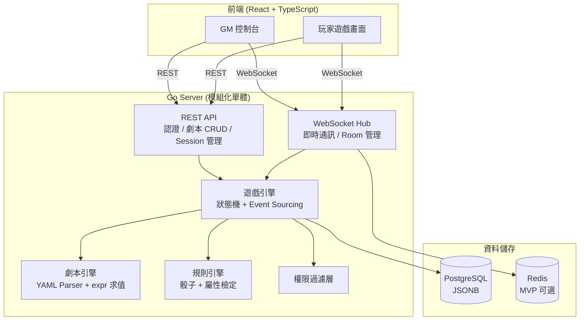
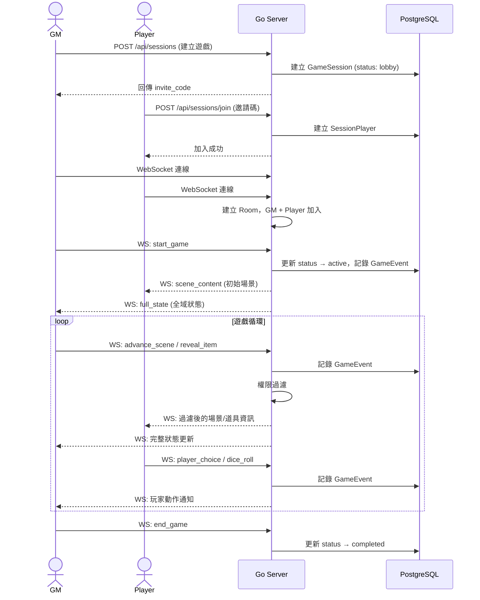
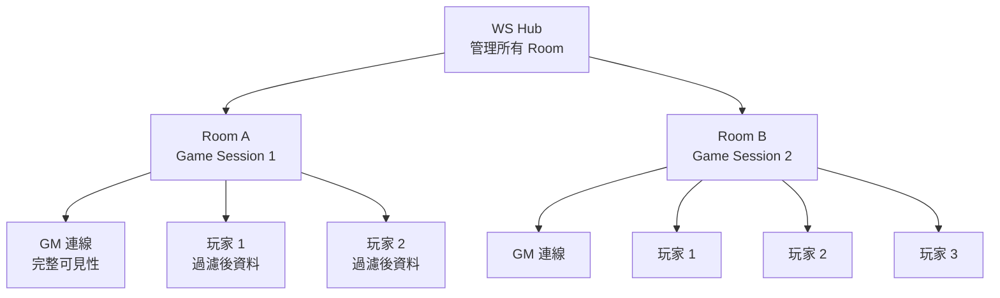
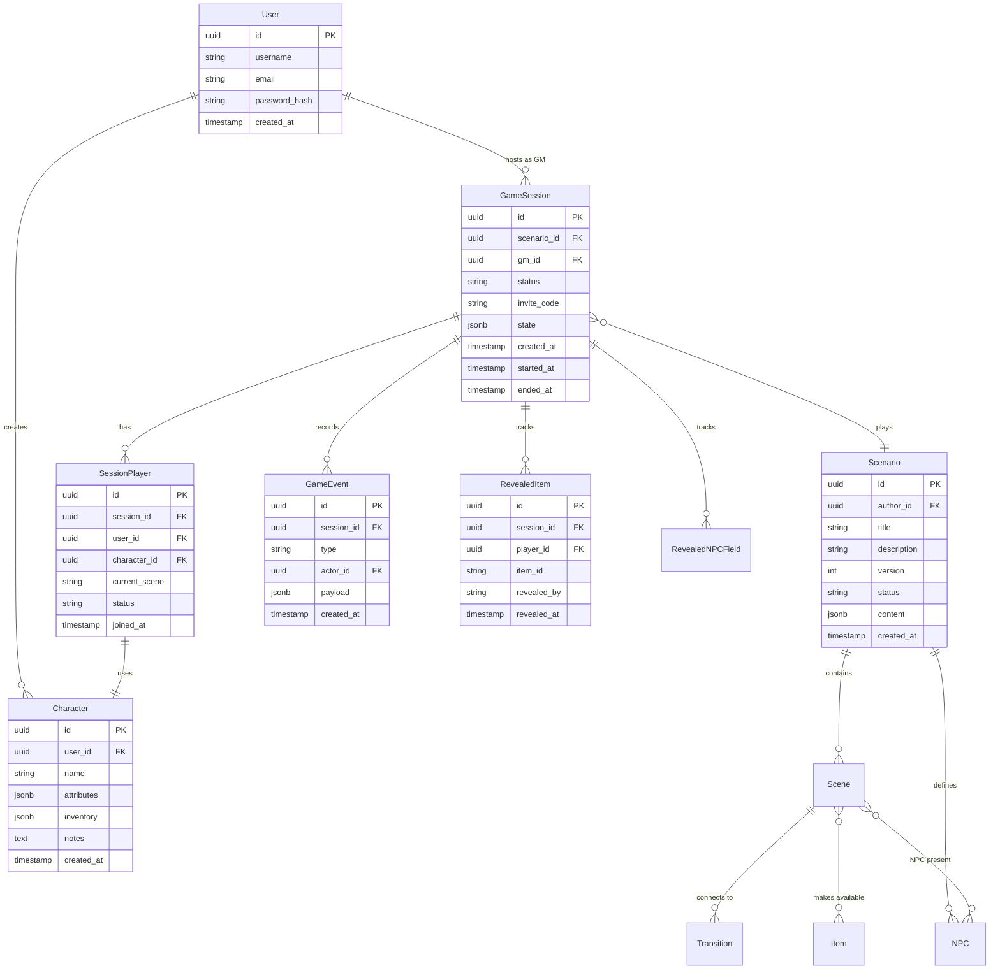
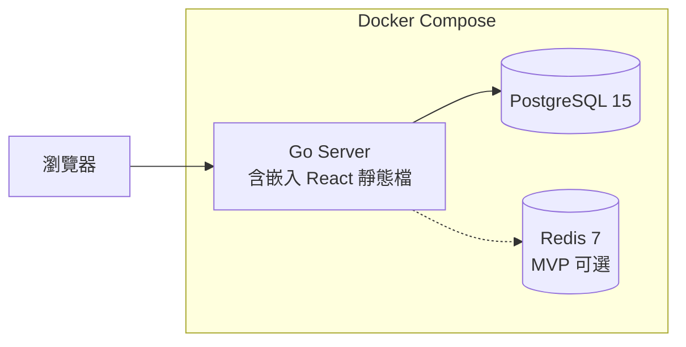

# Architecture — 系統架構文件

| 欄位 | 內容 |
|------|------|
| **專案** | TRPG-Simulation |
| **版本** | v0.1.0 |
| **最後更新** | 2026-02-27 |

---

## 系統概覽

TRPG-Simulation 是一個線上 TRPG 遊戲輔助平台，讓 GM（主持人）上傳 YAML 劇本並主持遊戲，玩家透過網頁即時檢視場景、道具與骰子結果，並做出選擇。語音與文字溝通由外部工具（如 Discord）處理。系統採用模組化單體架構，Go 後端同時提供 REST API 和 WebSocket 即時同步，React SPA 前端提供 GM 控制台和玩家唯讀遊戲畫面（含選擇與擲骰互動）。

---

## 架構圖



---

## 模組清單

| 模組 | 職責 | 路徑 |
|------|------|------|
| server | HTTP server、middleware、路由註冊 | `internal/server/` |
| auth | JWT 認證、用戶註冊/登入 | `internal/auth/` |
| scenario | 劇本 CRUD、YAML parser、場景圖驗證 | `internal/scenario/` |
| game | GameSession 生命週期、狀態機、event sourcing | `internal/game/` |
| realtime | WebSocket hub、room、client 管理、訊息廣播 | `internal/realtime/` |
| player | 玩家/角色 CRUD | `internal/player/` |
| item | 道具/線索揭露邏輯、條件判斷 | `internal/item/` |
| rule | 骰子引擎、表達式求值、屬性解析 | `internal/rule/` |
| config | 環境設定載入 | `internal/config/` |

---

## 資料流

### 遊戲進行流程



> **Note:** 語音與文字聊天不經由平台，由外部工具（如 Discord）處理。WebSocket 僅傳輸遊戲機制事件（場景、道具、骰子、選擇、GM 投放）。

### WebSocket Hub-Room 模式



WebSocket 訊息信封格式：

```json
{
  "type": "scene_change | item_reveal | npc_field_reveal | dice_roll | gm_broadcast | state_sync | player_choice | error",
  "session_id": "uuid",
  "sender_id": "uuid",
  "target_ids": ["uuid"],
  "payload": {},
  "timestamp": 1709020800
}
```

---

## 領域模型



---

## 劇本（Scenario）場景圖模型

劇本為有向圖結構，場景（Scene）為節點，轉場（Transition）為邊，存為 PostgreSQL JSONB：

| 元素 | 說明 |
|------|------|
| **Scene** | id, name, content（敘述文字）, gm_notes, items_available, npcs_present, on_enter/on_exit actions |
| **Transition** | target_scene, trigger_type (auto / gm_decision / player_choice / condition_met), conditions |
| **Item** | id, name, type (item / clue / prop), description, image（可選）, reveal_condition |
| **NPC** | id, name, image（可選）, fields[]（key, label, value, visibility: public/hidden）。GM 可逐欄位揭露給指定玩家 |
| **Variable** | 劇本自定義狀態變數（布林、整數、字串） |
| **Rules** | 每個劇本可自定義骰子公式、屬性清單、檢定方式 |

條件表達式使用 `expr-lang/expr` 求值，內建函式：
- `has_item(item_id)` — 玩家持有道具
- `roll(dice_notation)` — 擲骰（例：`roll('2d6')`）
- `attr(name)` — 讀取角色屬性
- `var(name)` — 讀取劇本變數

---

## 外部依賴

| 依賴 | 用途 | 版本 |
|------|------|------|
| PostgreSQL | 主資料庫（JSONB 儲存劇本/角色屬性） | 15+ |
| Redis | WebSocket session 註冊、pub/sub（MVP 可選） | 7+ |

---

## 部署架構



- **部署目標**：單台 VPS (2-4 vCPU) 或 PaaS (fly.io / Railway)
- **擴展路線**：單實例 → 加 Redis pub/sub → 多 app container + Nginx → K8S（遠期）

---

## 安全邊界

- **認證**：JWT token，登入取得 access token + refresh token
- **WebSocket 授權**：連線時驗證 JWT，加入 Room 時驗證 session 成員身份
- **權限過濾**：伺服器端過濾 WebSocket 廣播，玩家永遠不會收到 GM 筆記、其他玩家私有資料、未揭露的道具
- **劇本安全**：YAML DSL + expr 表達式引擎（沙箱執行），不允許任意程式碼

---

## 已知技術債

- [ ] YAML DSL 在極複雜劇本邏輯下可能不足，未來可能需疊加 Lua 層（ADR 追蹤）
- [ ] MVP 不含 Redis，單實例限制橫向擴展（預估可支撐數百同時在線）
- [ ] 尚無視覺化劇本編輯器，GM 需直接編寫 YAML（Phase 2+ 考慮）

---

## 關聯 ADR

- ADR-001：初始技術棧選型（Accepted）
- ADR-002：即時通訊策略（Accepted）
- ADR-003：劇本資料模型與 DSL 設計（Accepted）
- ADR-004：遊戲狀態管理（Accepted）
- ADR-005：認證與權限模型（Accepted）
